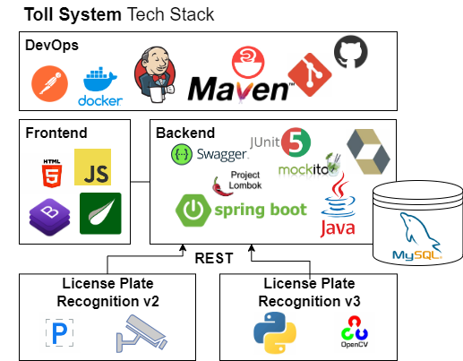

# tfg-toll-system-public
This repository hosts my bachelor thesis project, a comprehensive exploration of cutting-edge technologies in the development of a prototype toll system application.

## Tech Stack used

- DevOps
  - Jenkins
  - Docker
  - Postman
  - Maven
- Back-end
  - Spring
  - MySQL
  - Hibernate
- Front-end
  - JavaScript
  - HTML, CSS
  - Bootstrap
  - Thymeleaf
- Tests
  - JUnit5
  - Mockito
- LPR (License Plate Recognition)
  - Python, OpenCV, Tessaract
  - Plate Recognizer API
 
## Architecture
The architecture of the system:

## A little video demo:

